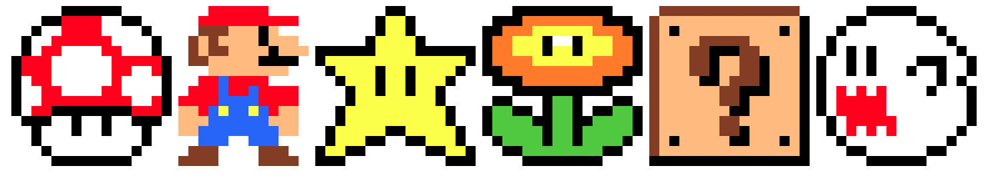

# 2d-Mario-Characters with JS and CSS3

Mario 2D Characters using JS, HTML5 & CSS3.

The idea behind this is to create a GRID using 2D javascript arrays. 

I found this implementaion [css-tricks](https://css-tricks.com/fun-times-css-pixel-art/) and PEN BY Una Kravets [code-pen](https://codepen.io/una/pen/oXXRgg) using SCSS and thought of implementing this using Javascript. The concept is similar but I am using the 2D array to read the pixel-map color to make the element.

## What it looks like?

## On Codepen

Find it here on [Codepen](https://codepen.io/ankursehdev/pen/JzLjrP)

## Next

1. I will be writing a reactJS application to handle all the colors dynamically.

## License
License: none (public domain)

## Acknowledgments

Thanks to [meyerweb](http://meyerweb.com/eric/tools/css/reset/) for reset CSS
Thanks to PEN BY Una Kravets [code-pen](https://codepen.io/una/pen/oXXRgg) for real concept using CSS.
Thanks to [css-tricks](https://css-tricks.com/fun-times-css-pixel-art/) for bringing all together.
